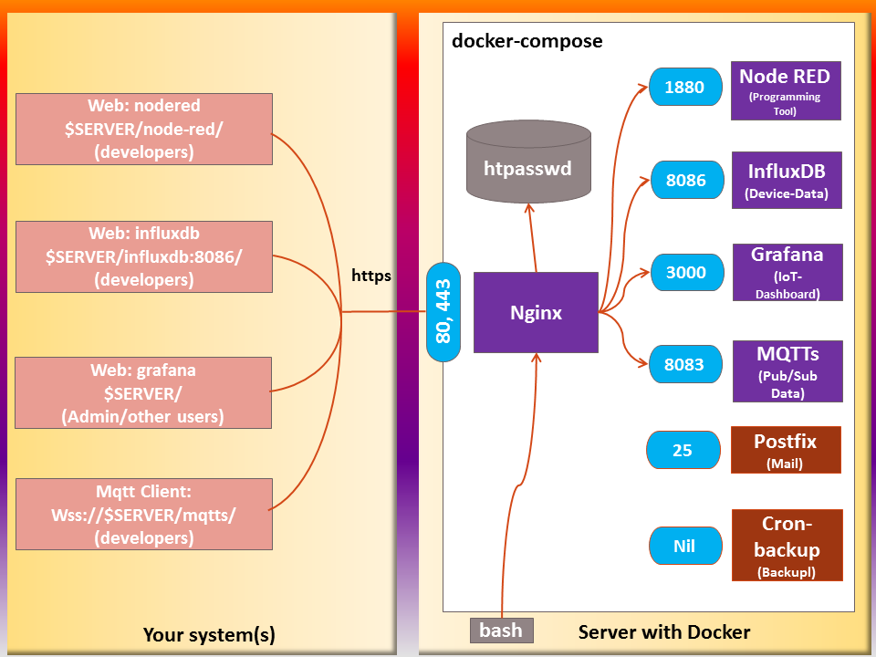

# Ejemplo de Dashboard para Internet of Things (IoT) - BASADO EN https://github.com/mcci-catena/docker-iot-dashboard - NO VALIDO PARA PRODUCCION - SOLO FINES EDUCATIVOS
Este repositorio contiene un ejemplo básico que recoge datos de un dispositivo desde un servidor IOT en red, los almacena en una DB y los muestra utilizando un dashboard web.
Puedes desplegarlo en un droplet Docker de [Digital Ocean](https://www.digitalocean.com/) (o en una VM Ubuntu de [DreamCompute](https://www.dreamhost.com/cloud/computing/), o en una VM "Ubuntu + Docker" de la [Microsoft Azure store](https://portal.azure.com/) ) con un esfuerzo mínimo. Deberías desplegar este servicio para que se ejecute en todo momento y capture los datos de tu dispositivo; después podrás acceder cuando quieras a esos datos usando un navegador web.
## Tabla de Contenidos

<!-- markdownlint-disable MD033 -->
<!-- markdownlint-capture -->
<!-- markdownlint-disable -->
<!-- TOC depthFrom:2 updateOnSave:true -->

- [Introduccion](#introduccion)
- [Definiciones](#definiciones)
- [Seguridad](#seguridad)
- [Premisas](#premisas)
- [Composicion y Puertos Externos](#composicion-y-puertos-externos)
- [Data Files](#data-files)
- [Reutilización y borrado de data files](#reutilizacion-y-borrado-de-data-files)
- [Ejemplos de Node-RED y Grafana](#ejemplos-de-node-red-y-grafana)
	- [Conectando a InfluxDB desde Node-RED y Grafana](#conectando-a-influxdb-desde-node-red-y-grafana)
	- [Iniciando sesión en Grafana](#iniciando-sesion-en-grafana)
	- [Ajustes de Data Source en Grafana](#ajustes-de-data-source-en-grafana)
- [Ejemplos MQTTS](#ejemplos-mqtts)
- [Instrucciones de Setup](#instrucciones-de-setup)
- [Backup y Restore de Influxdb](#backup-y-restore-de-influxdb)
- [Meta](#meta)

<!-- /TOC -->
<!-- markdownlint-restore -->
<!-- Due to a bug in Markdown TOC, the table is formatted incorrectly if tab indentation is set other than 4. Due to another bug, this comment must be *after* the TOC entry. -->

## Introduccion

Este [`SETUP.md`](./SETUP.md) explica la instalación del Application Server y su configuración. [Docker](https://docs.docker.com/) y [Docker Compose](https://docs.docker.com/compose/) se utilizan para facilitar la instalación y configuración de este setup.

Este dashboard utiliza [docker-compose](https://docs.docker.com/compose/overview/) para configurar un grupo de contenedores [docker containers](https://www.docker.com) primarios

1. Una instancia de [Node-RED](http://nodered.org/), que procesa los datos de los nodos individuales y los introduce en la DB.

2. Una instancia de [InfluxDB](https://docs.influxdata.com/influxdb/), que almacena los datos como unos measurements de series de tiempos con tags y provee respaldos para la DB.

3. Una instancia de [Grafana](http://grafana.org/), que proporciona un dashboard basado en web para los datos.

4. Una instancia de [Mqtt](https://mosquitto.org/), que proporciona un método ligero para transportar mensajes utilizando un modelo de publicación/suscripción.

5. Una instancia de [Chirpstack] (https://chirpstack.io), que proporciona soporte para la transmisión de datos y gestión de dispositivos LoRaWAN


Para hacer las cosas más específicas, muchas de las descripciones aquí asumen el uso de Digital Ocean. Sin embargo, esto ha sido probado en Ubuntu 20.04 sin problemas (más allá de la complejidad adicional de configurar `apt-get` para instalar docker y la necesidad de una instalación manual de `docker-compose`). Este setup debería funcionar en cualquier plataforma Linux o Linux-like que soporte `docker` y `docker-compose`. **Nota** No hemos probado que funcione en una Raspberry Pi.

## Definiciones

- El **sistema host** es el sistema que corre Docker y Docker-compose.
- El **contenedor** es uno de los sistemas virtuales corriendo bajo docker en el sistema host.

- Un **archivo en el host** es un archivo presente en el sistema host (tipicamente no
    visible por los contenedor(es)).

- Un **archivo en el contenedor X** es un archivo presente en un filesystem asociado
    con el contenedor X (y tipicamente no visible por el sistema host)
    

## Seguridad

ESTE DESPLIEGUE SE HA REALIZADO CON FINES PURAMENTE EDUCATIVOS. ES TOTALMENTE INSEGURO PARA UTILIZAR EN PRODUCCION


### Acceso Usuario

|**Para acceder**| **Abrir Link**| **Notas**|
|-------------|-------------------|----------|
| Node-RED    | <http://localhost:1880> |  |
| InfluxDB API queries | <http://localhost:8086/> |  |
| Grafana    | <http://localhost:3000> |  |
| Mqtt       | <http://localhost:1883>| Se necesita un cliente MQTT. Puedes probar utilizando [Mqtt web portal](http://tools.emqx.io/) |
| Chirpstack | <http://localhost:8080> |  | 
| Chronograf | <http://localhost:8888> |  |

Esto se puede visualizar en la figura inferior.

### Docker connection and User Access



## Premisas

- El sistema host debe contar con docker-compose version 1.9 o superior

- La variable de entorno IOT_DASHBOARD_DATA`, si está establecida, debe apuntar al directorio común. Si no está asignada, docker-compose se detendrá al arrancar. (Esto es por diseño)

  - `${IOT_DASHBOARD_DATA}node-red` almacenará los datos locales de Node-RED.

  - `${IOT_DASHBOARD_DATA}influxdb`  almacenará los datos locales de InfluxDB (deberías hacer backups de esta carpeta)

  - `${IOT_DASHBOARD_DATA}grafana` almacenará los dashboards
  
  - `${IOT_DASHBOARD_DATA}mqtt/credentials` almacenará las credenciales de usuario
  
  - `${IOT_DASHBOARD_DATA}chirpstack` almacenará el network, application y gateway servers de chirpstack
  
  - `${IOT_DASHBOARD_DATA}postgres` almacenará la base de datos postgres utilizada por Chirpstack


## Composición y Puertos Externos

En los contenedores, cada programa individual utiliza sus puertos habituales, pero éstos están aislados del mundo exterior excepto lo que hayamos declarado en el archivo `docker-compose.yml`.

En el `docker-compose.yml`, vamos a conectar los siguientes puertos del host docker a cada programa individual

- Grafana utiliza el 3000/tcp.

- Influxdb utiliza el 8086/tcp.

- Node-red utiliza el 1880/tcp.

- Chronograf utiliza el 8888/tcp.

- Chirpstack utiliza el 8080/tcp.

## Archivos de datos

Al diseñar esta colección de servicios, teniamos dos opciones para almacenar los archivos de datos:

- podemos mantenerlos en el interior de los contenedores docker, o

- podemos mantenerlos en ubicaciones del sistema host.

La ventaja de la primera opción es que todo se resetea cuando reconstruimos las imagenes docker. La desventaja es que existe la posibilidad de perder todos los datos cuando se reconstruye. Por otro lado, tenemos un nivel adicional de indirección cuando guardamos datos en el host, ya que los archivos residen en unas rutas en el host y en otras en los contenedores docker.

Como los datos IoT son normalmente persistentes, hemos decidido que se requería el nivel extra de indirección. Para ayudarte a encontrar las cosas, consulta la siguiente tabla. Los archivos de datos se almacenan en esta ubicación por defecto.

| **Componente** | **ruta de los archivos en el host**| **ruta en el contenedor**  |
|---------------|-----------|----------------------------|
| Node-RED      | `${IOT_DASHBOARD_DATA}node-red`| /data
| InfluxDB      |  `${IOT_DASHBOARD_DATA}influxdb` | /var/lib/influxdb
| Grafana       | `${IOT_DASHBOARD_DATA}grafana` | /var/lib/grafana|
| Mqtt | `${IOT_DASHBOARD_DATA}mqtt/credentials` | /etc/mosquitto/credentials
| Chirpstack | `${IOT_DASHBOARD_DATA}chirpstack/configuration`| /etc/chirpstack-*

Tal como se muestra, podemos cambiar fácilmente las ubicaciones en el **host** (p.ej, para pruebas). Podemos hacer esto asignando la variable IOT_DASHBOARD_DATA` a la **ruta absoluta** (con una barra diagonal) del directorio comñun qe queramos utilizar antes de llamar a "docker-compose up". Las rutas de la tabla superior se añaden al valor de la variable `IOT_DASHBOARD_DATA`. Los directorios se crean según sean necesarios.

Normalmente realizamos esto declarando la variable apropiada en el archivo `.env`.

Si consideramos el siguiente ejemplo:
```console
$ grep IOT_DASHBOARD_DATA .env
IOT_DASHBOARD_DATA=/dashboard-data/
$ docker-compose up –d
```
En este caso, los archivos de datos se crearán en las siguientes ubicaciones:

Tabla de ejemplos de ubicacion de datos

| **Componente** | **Ubicación del archivo de datos**            |
|---------------|-----------------------------------|
| Node-RED      | /dashboard-data/node-red          |
| InfluxDB      | /dashboard-data/influxdb          |
| Grafana       | /dashboard-data/grafana           |
| Mqtt          | /dashboard-data/ mqtt/credentials |
| Chirpstack    | /dashboard-data/chirpstack        |

## Reutilización y borrado de los archivos de datos

Como los archivos de datos no se eliminan al reiniciar los contenedores, mientras los archivos no se modifiquen entre ejecuciónes, se van a preservar los datos.

Algunas veces esto puede ser inconveniente y es necesario eliminar parte o la totalidad de los datos. Por varias razones, los archivos y directorios son creados por el usuario root, así que deberás utilizar `sudo` para eliminar los archivos. Aquí tienes un ejemplo de como hacerlo:

```bash
source .env
sudo rm -rf ${IOT_DASHBOARD_DATA}node-red
sudo rm -rf ${IOT_DASHBOARD_DATA}influxdb
sudo rm -rf ${IOT_DASHBOARD_DATA}Grafana
sudo rm –rf ${IOT_DASHBOARD_DATA}mqtt/credentials
```

## Ejemplos de Node-RED y Grafana

Esta versión requiere que configures Node-RED, MQTT, Chirpstack, InfluxDB y Grafana manualmente.

### Conectar a InfluxDB desde Node-RED y Grafana

Este punto a veces puede confundir para configurar las conexiones desde Node-RED y Grafana a InfluxDB. Aunque InfluxDB está ejecutandose en el mismo host, lógicamente esta ejecutándose en su propio espacio de nombres (creado por docker). Por esto, Node-RED y Grafana no pueden configurarse para que utilicen **`local host`** como dirección de conexión a InfluxDB. Al correr dentro de la misma red, docker proporciona el nombre del contenedor `influxdb` (sin sufijo DNS). 


### Iniciando sesión en Grafana

En la pantalla de login, el usuario inicial es "`admin`". El password inicial se puede establecer pasando la siguiente variable de entorno
`IOT_DASHBOARD_GRAFANA_ADMIN_PASSWORD` en `.env` o en el propio docker-compose.yml. Ten en cuenta que si cambias el password en el archivo  `.env` después del primer arranque del contenedor, no cambiarás el password del admin. Si pierdes el password del admin y no tienes otro usuario con derechos de admin, es muy dificil recuperarlas, Tal vez sea más sencillo eliminar el archivo `grafana.db` y empezar de nuevo.

### Ajustes del Data source en Grafana

- Ajusta la URL (en HTTP Settings) a <http://influxdb:8086>.

- Elige la base de datos.

- Introduce el usuario y password.

- Click "Save & Test".

## Ejemplos de MQTT(S) 

Puedes acceder a MQTTs de las siguientes formas:

Method  |  Port | Credentials
--------|------|------------
MQTT over TLS/SSL | 8883 | Username/Password desde archivo de configuración de mosquitto (password_file)
MQTT over TCP protocol (NO SEGURO) |  1883 | Username/Password desde archivo de configuración de mosquitto (password_file)

## Instrucciones de Setup

Revisa [`SETUP.md`](./SETUP.md) para instrucciones detalladas de setup


## Meta
